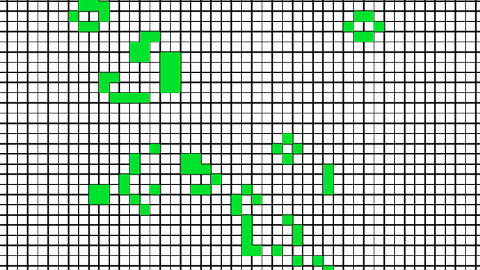

# Game of life 
This is a Go implementation of Conway's Game of Life using the raylib library for rendering.



## Installation

### Prerequisites

Before you begin, make sure you have the following installed on your system:

- Go programming language

### Installing raylib-go

 1- Follow the installation instructions for raylib from their GitHub repository: [raylib-go installation](https://github.com/gen2brain/raylib-go)

### Installing Go and raylib bindings

1- Install Go from the official Go website: [Download Go](https://golang.org/dl/).

2- Clone the repository.
```bash
git clone https://github.com/4dot4/gameoflifeGo.git
```
3- Navigate to the directory containing the cloned repository.
```bash
cd gameoflifeGo
```
4- Build the project using go build
```bash
go build
```
5- Run the project 
```bash
./gameoflife
```
    
